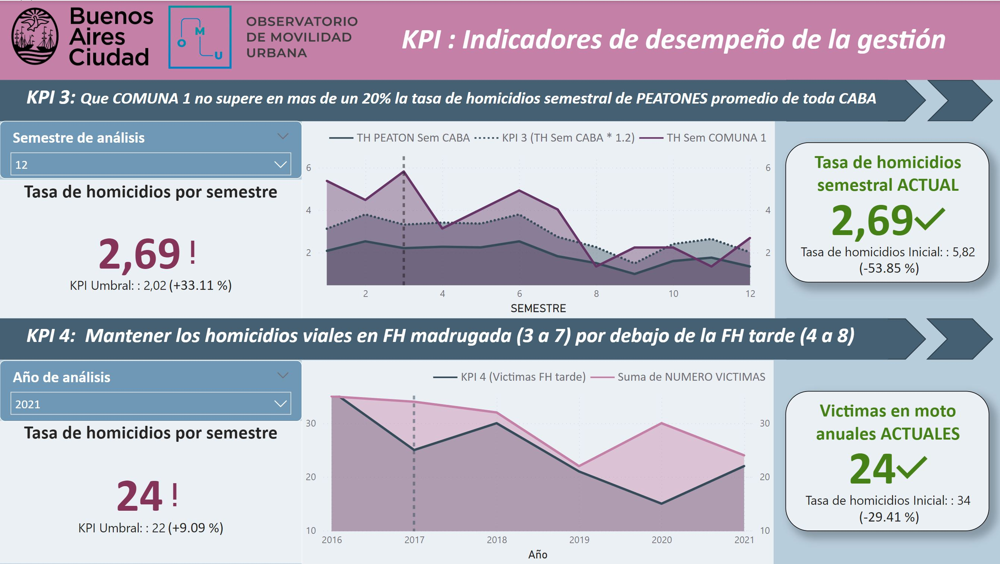

# PI_Henry_Urteaga
<h1 align="center"> Proyecto Individual Nº 2  </h1>
<h3 align="center"> Siniestros Viales </h3>
<h3 align="center"> Autor: Bioing. Facundo Urteaga  </h3>
<h3 align="center"> Dashboard público del proyecto: https://app.powerbi.com/view?r=eyJrIjoiZjU2OWYxMjQtYTA3ZS00NzJmLTk1OTQtZmUwZTczNGU0YzdhIiwidCI6IjQ4MWNkNjcxLTY3NWMtNDA0MC05NzFmLWZjMDBmZTk1OGY2NiIsImMiOjR9 </h3>

   
   

## Índice

*[Descripción del proyecto](#descripción-del-proyecto)

*[Rol del Analista de Datos](#rol-del-analista-de-datos)

*[Exploratory Data Analysis](#exploratory-data-analysis)

*[Dashboard Introducción](#dashboard-introducción)

*[Dashboard KPIs](#dashboard-kpis)

*[Conclusiones Finales](#conclusiones-finales)

## Descripción del proyecto

Los siniestros viales, que incluyen colisiones entre vehículos, atropellos y choques con objetos fijos, son una preocupación importante en ciudades con alto volumen de tráfico y densidad poblacional, como Buenos Aires. Estos accidentes pueden causar desde daños materiales hasta lesiones graves o fatales, afectando significativamente la seguridad de los residentes y la infraestructura vial. Las tasas de mortalidad por siniestros viales, calculadas como el número de muertes por habitantes o vehículos registrados, son un indicador crucial de la seguridad vial. Reducir estas tasas es esencial para proteger vidas, y esto requiere la implementación de medidas preventivas como educación vial, cumplimiento de normas de tráfico, mejoras en la infraestructura y promoción de vehículos seguros.

En Argentina, los siniestros viales son la principal causa de muertes violentas, con cerca de 4.000 muertes anuales. Entre 2018 y 2022, se registraron 19.630 muertes en el país, lo que equivale a 11 personas fallecidas por día. En 2022, hubo 3.828 muertes fatales por accidentes de tránsito, y la probabilidad de morir en un siniestro vial es significativamente mayor que en un acto de inseguridad delictiva. En respuesta a esta problemática, el Observatorio de Movilidad y Seguridad Vial (OMSV) de Buenos Aires ha solicitado la elaboración de un proyecto de análisis de datos para ayudar a las autoridades locales a tomar medidas para reducir las víctimas fatales de los siniestros viales. Para este propósito, se ha proporcionado un dataset sobre homicidios en siniestros viales en Buenos Aires entre 2016 y 2021, que incluye información detallada en formato xlsx con hojas de datos y diccionarios.

## Rol del Analista de Datos

Desde el año 2017 formo parte del equipo de trabajo del OMSV de la Ciudad Autónoma de Buenos Aires como Data Analytics. Ya pasaron 4 años, elecciones de por medio y ganó un partido político distinto al que nos designo en su momento para este trabajo. Si bien no son las mejores noticias, las nuevas autoridades nos dieron la posibilidad de defender el trabajo hecho hasta ahora y, en caso de mostrar resultados satisfactorios, tenemos la oportunidad de seguir en el cargo con estas nuevas autoridades. Para esto, debemos demostrar que producto de nuestro monitoreo y medidas tomada a lo largo de estos años, la Ciudad Autónoma de Buenos Aires se encuentra significativamente mejor en relación a víctimas fatales en siniestros viales.

## Exploratory Data Analysis

Herramientas utilizadas: Lenguaje Python en IDE Microsoft Visual Studio Code
Con los datos recolectados durante estos años de siniestros que involucran homicidios, se realizó un análisis exploratorio de los datos. Inicialmente se realizó un control de la existencia de datos nulos y outliers o información incompleta en las columnas. No se detectaron outliers, pero se detectaron datos faltantes bajo la codificaciòn "SD" lo cual facilitó el procesamiento.
La segunda parte consistió en explorar por primera vez los datos en búsqueda de patrones que puedan facilitar posteriormente las conclusiones, la creación de nuevos KPIs y a su vez detectar variables que no muestran ningun tipo de variación o comportamiento para no perder tiempo luego. De esta etapa se destaca que se encontraron comportamientos interesantes en el la distribución de los hechos por tipo de calle (Figura 1), y cantidad de hechos por franja horaria (Figura 2).
En una tercera parte, se procesaron las columnas de "cruce" y "altura" y se sintetizaron en una sola variable que categorizaba si el siniestro ocurrió en una esquina, en la cuadra o directamente en una autopista (Figura 3).

   

   <em>Figura 1: Distribución de homicidios por tipo de calle </em>

   

   <em>Figura 2: Distribución de homicidios por franja horaria </em>

   

   <em>Figura 2: Distribución de homicidios por tipo de zona </em>

## Dashboard Introducción

Herramientas utilizadas: POWER BI DESKTOP
La introducción del dashboard corresponde a la primera página "INTRO" del proyecto de POWER BI (Figura 4). El propósito de este primer lienzo, es interiorizar al espectador con el contexto inicial en el cual nos encontramos al tomar posesión del cargo en el año 2017, y los aspectos relevantes que osbervamos como "Puntos clave" a tener en cuenta en las políticas de seguridad vial en los años próximos para mitigar los problemas que detectamos.

PUNTOS CLAVES:

* Alto número de víctimas viales totales
* Accidentes en motocicleta significativos
* La COMUNA 1 es la que tiene la mayor tasa de homicidios
* COMUNA 1: Franja Horaria de madrugada con gran tasa de homicidios
* COMUNA 1: Homicidios viales preponderantemente de PEATONES
* La mayor cantidad de homicidios ocurre en las ESQUINAS de calles y avenidas

ACCIONES DE MITIGACIÓN:

* Mejorar los cursos de educación vial al momento de solicitar o renovar el carnet
* Mayores controles a motociclistas y aumento de penalización por el NO uso de CASCO
* En la COMUNA 1 mayor cantidad de controles de alcoholemia en las horas claves de la madrugada
* En Discotecas de la COMUNA 1 aumento de campañas y estrategias para la promoción de "conductores designados"
* Para la reducción de PEATONES circulando durante la madrugada se establecieron precios promocionales subsidiados de servicios de TAXIS durante horas clave
* Mejora de la señalización en esquinas y se agregaron lomos de burro estratégicos

   

   <em>Figura 4: Dashboard de introducción </em>

## Dashboard KPIs

Herramientas utilizadas: POWER BI DESKTOP
Los KPIs se detallaron en los lienzos "KPIs 1" (Figura 5) y "KPIs 2" (Figura 6). A continuación se detalla cada uno de los 4 KPIs diseñados.

KPI 1 
* Objetivo: Reducción de un 10% de la tasa de homicidios respecto al semestre anterior
* Justificación: KPI sencillo que tiene como finalidad reducir progresivamente la tasa de homicidios en cada semestre
* Evolución: A partir del semestre 7 se observan buenos resultados que luego son alterados por la pandemia de COVID y otros factores
* Resultado final: Se logró bajar casi en un 40% la tasa de homicidios respecto al comienzo de la gestión

KPI 2 
* Objetivo: Reducción de un 7% de la cantidad de accidentes mortales de motos respecto al año anterior
* Justificación: Se detectó un gran porcentaje de víctimas motociclistas por lo que se buscó una disminución progresiva de estos homicidios
* Evolución: Se observa una buena evolución a partir del año 2018. El último año los resultados no fueron satisfactorios
* Resultado final: Se logró bajar en un 17% la cantidad de homicidios de MOTOCICLISTAS respecto al comienzo de la gestión

KPI 3 
* Objetivo: Que COMUNA 1 no supere en mas de un 20% la tasa de homicidios semestral de PEATONES promedio de toda CABA
* Justificación: Al detectarse un gran porcentaje anormal de homicidios de PEATONES en la COMUNA 1 se buscó reducir esta tasa de homicidios y equipararla al promedio de CABA
* Evolución: A partir del octavo semestre se observan resultados satisfactorios, sin embargo al finalizar la gestión nos encontramos por encima del KPI
* Resultado final: Se logró bajar a la mitad la tasa de homicidios de PEATONES respecto al comienzo de la gestión

KPI 4 
* Objetivo: Mantener los homicidios viales en FH madrugada (3 a 7) por debajo de la FH tarde (4 a 8)
* Justificación: La nocturnidad de la COMUNA 1 afecta drásticamente a los homicidios ocurridos durante la madrugada. En este KPI se busca atenuar los homicidios en esta FH, buscando equipararlo con la FH de tarde, la cual en general mantiene una tasa regular que solo se ve afectada por factores externos, por lo que es un buen indicador.
* Evolución: Se observa un acercamiento prometedor de la FH madrugada en cantidad de víctimas que luego es abruptamente interrumpido por la pandemia de COVID.
* Resultado final: Se logró bajar casi en un 30% la cantidad de homicidios en la FH madrugada y además se observa una tendencia alentadora

   

   <em>Figura 5: Dashboard de KPIS 1 </em>

   

   <em>Figura 6: Dashboard de KPIS 2 </em>

## Conclusiones Finales

Si bien los objetivos planteados por los KPIS fueron parcialmente logrados en distintos instantes de tiempo, el hecho de plantearlos definió una hoja de ruta en la gestión para lograr una reducción relevante y considerable en los homicidios de siniestros viales tanto en general como en particular en zonas y categorías estratégicas.

